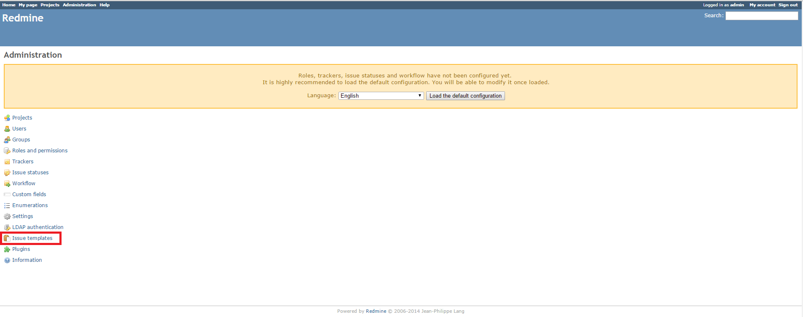
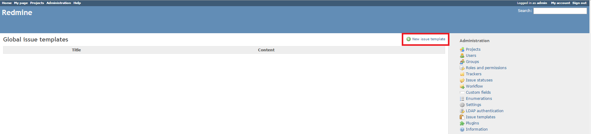
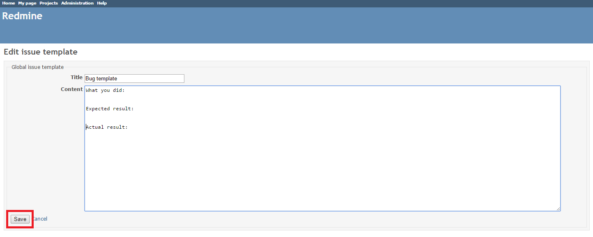
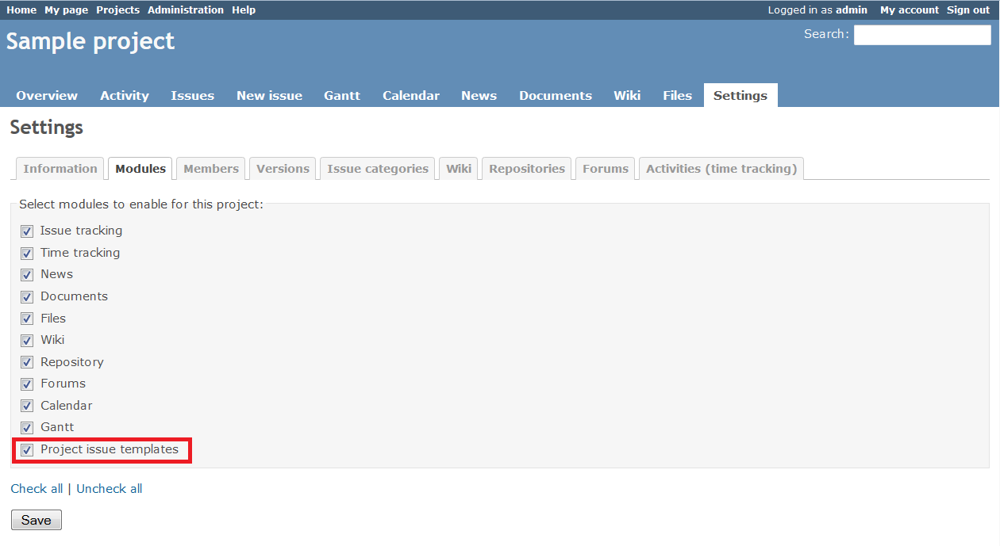
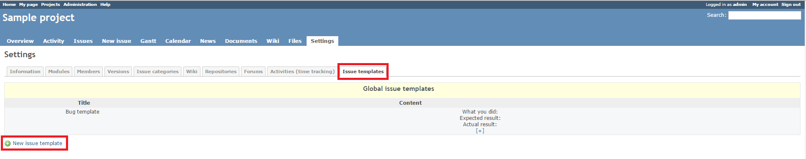
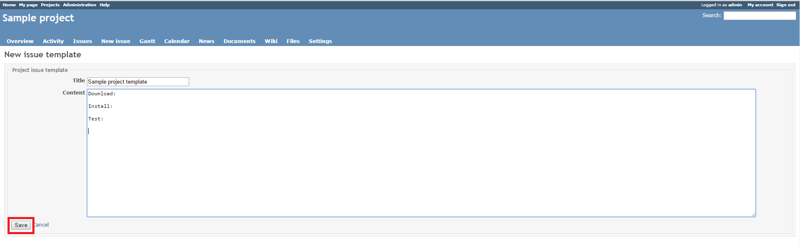
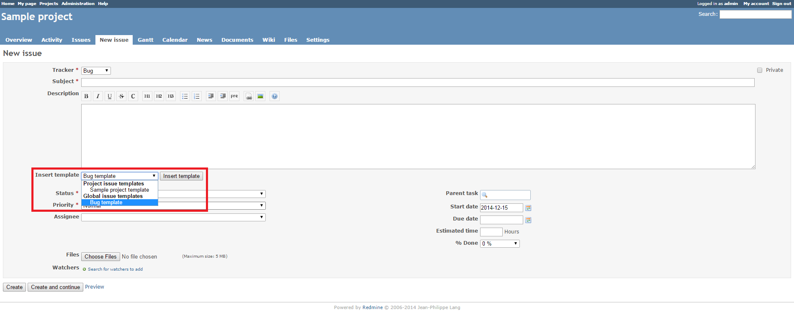
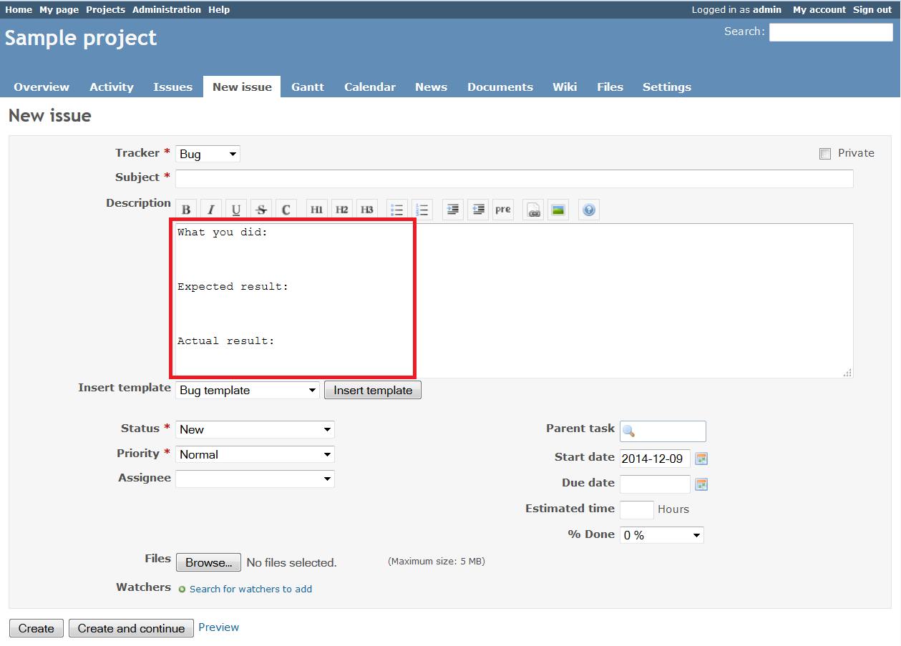
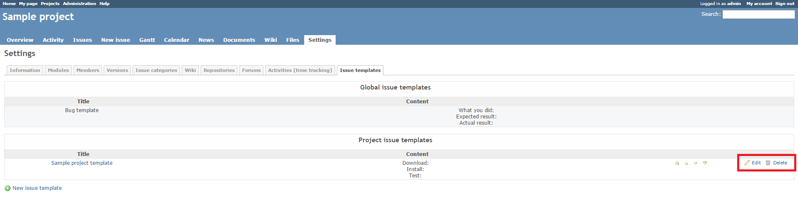
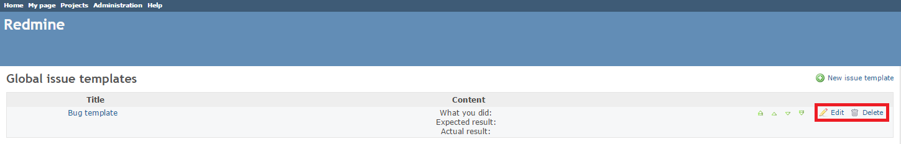

# Redmine Issue Template Plugin

This plugin enables you to create global Redmine issue templates or templates for specific Redmine projects.

## Compatibility

This plugin version is compatible only with Redmine 2.1.x and later.

## Installation

1. To install the plugin
    * Download the .ZIP archive, extract files and copy the plugin directory into *#{REDMINE_ROOT}/plugins*.
    
    Or

    * Change you current directory to your Redmine root directory:  

            cd {REDMINE_ROOT}
 
      Copy the plugin from GitHub using the following command:

            git clone https://github.com/Restream/redmine_issue_template.git plugins/redmine_issue_template

2. Update the Gemfile.lock file by running the following commands:  

         rm Gemfile.lock  
         bundle install

3. This plugin requires a migration. Run the following command to upgrade your database (make a database backup before):  

        bundle exec rake redmine:plugins:migrate RAILS_ENV=production

4. Restart Redmine.

Now you should be able to see the plugin in **Administration > Plugins**.

## Usage

1. To create a global issue template
    1. Go to **Administration > Issue templates** and click **New issue template**.  
        
      
    2. Add the template title and content and click **Save**.  
    
2. To add an issue template for a specific project
    1. Enable the project issue template module on the project **Settings** tab.  
        
      This will add a new **Issue templates** tab to the project settings.
    2. Switch to the **Issue templates** tab and create the required project issue templates.  
        
    3. Add the template title and content and click **Save**.  
    
3. To use a template when you create a new issue
    1. Select the required issue template and click **Insert template**.  
    
    2. The template's text will be added to the issue description field at the cursor position.  
    
4. To edit or delete the project issue template, go to the **Issue templates** tab of the project settings.  
  
  Note that **Issue templates** tab displays both global and project templates.
5. To edit or delete the global issue template, go to **Administration > Issue templates**.  

## Maintainers

Danil Tashkinov, [github.com/nodecarter](https://github.com/nodecarter)

## License

Copyright (c) 2016 Restream

Licensed under the Apache License, Version 2.0 (the "License");
you may not use this file except in compliance with the License.
You may obtain a copy of the License at

http://www.apache.org/licenses/LICENSE-2.0

Unless required by applicable law or agreed to in writing, software
distributed under the License is distributed on an "AS IS" BASIS,
WITHOUT WARRANTIES OR CONDITIONS OF ANY KIND, either express or implied.
See the License for the specific language governing permissions and
limitations under the License.
